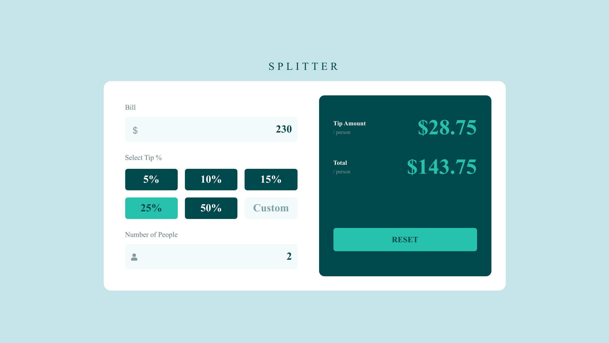

# Frontend Mentor - Tip calculator app solution

This is a solution to the [Tip calculator app challenge on Frontend Mentor](https://www.frontendmentor.io/challenges/tip-calculator-app-ugJNGbJUX). Frontend Mentor challenges help you improve your coding skills by building realistic projects.

## Table of contents

- [Frontend Mentor - Tip calculator app solution](#frontend-mentor---tip-calculator-app-solution)
  - [Table of contents](#table-of-contents)
  - [Overview](#overview)
    - [The challenge](#the-challenge)
    - [Screenshot](#screenshot)
    - [Links](#links)
  - [My process](#my-process)
    - [Built with](#built-with)
    - [What I learned](#what-i-learned)
    - [Useful resources](#useful-resources)
  - [Author](#author)

## Overview

### The challenge

Users should be able to:

- View the optimal layout for the app depending on their device's screen size
- See hover states for all interactive elements on the page
- Calculate the correct tip and total cost of the bill per person

### Screenshot



### Links

- Solution URL: [Solution](https://github.com/Adnan0-IM/tip-calculator-app)
- Live Site URL: [Live Demo](https://tip-calculator-r.netlify.app/)

## My process

### Built with

- Semantic HTML5 markup
- CSS custom properties
- Flexbox
- CSS Grid
- Mobile-first workflow
- [React](https://reactjs.org/) - JS library
- [Tailwind CSS](https://tailwindcss.com/) - For styles

### What I learned

During this project, I learned several key concepts:

- How to manipulate number input elements, particularly removing spinner buttons usin CSS
- Working with icon positioning in input fields
- Implementing responsive design with Tailwind CSS
- Managing state for calculator functionality

Code example of hiding number input spinners:

```css
input[type="number"] {
  -moz-appearance: textfield;
  -webkit-inner-spin-button,
  -webkit-outer-spin-button {
    -webkit-appearance: none;
  }
}
```

### Useful resources

- [React Icons](https://react-icons.github.io/react-icons/) - Comprehensive icon library for React applications
- [Tailwind CSS Documentation](https://tailwindcss.com/docs) - Essential reference for Tailwind CSS classes and utilities
- [MDN Web Docs](https://developer.mozilla.org/) - Detailed documentation for HTML, CSS, and JavaScript

## Author

- Website - [Adnan Iliyasu](https://adnan0-im.github.io/Frontend-Basics-Portfolio/)
- Frontend Mentor - [@Adnan0-IM](https://www.frontendmentor.io/profile/Adnan0-IM)
- Twitter - [@Adnan_imd](https://www.twitter.com/Adnan_imd)
